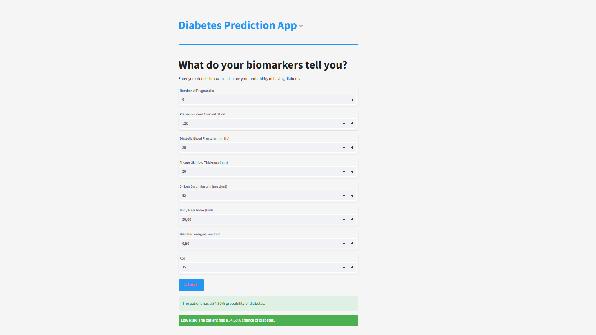

# Diabetes Prediction Tool

This project explores how low-code tools like Streamlit can be used to quickly prototype interactive machine learning applications. I wanted to test how fast I could go from concept to a working tool without heavy setup or frontend code — and see how viable Streamlit is for end-to-end deployment.

I chose a practical use case: predicting diabetes risk from basic health metrics. I applied feature engineering (including KMeans clustering) and trained an ensemble model combining XGBoost, LightGBM, and Logistic Regression to make predictions. The app allows users to input clinical data and receive instant, interpretable feedback on their diabetes risk.

While not intended as a production system, the project served as a hands-on experiment in deploying ML models with a clean user interface — showcasing how quickly functional tools can be built with the right frameworks.

---

## Background

The tool uses data from the Pima Indians dataset (`diabetes.csv`) to predict the likelihood of diabetes. The underlying models include an ensemble of **XGBoost**, **LightGBM**, and **Logistic Regression**, which have been trained and optimized using various techniques like feature engineering, clustering, and hyperparameter tuning. The focus is on providing interpretable and actionable predictions.

---

## Features

- **Interactive Interface**: A user-friendly Streamlit app for predicting diabetes probability.
- **Ensemble Model**: Combines XGBoost, LightGBM, and Logistic Regression for robust predictions.
- **Real-time Inputs**: Accepts user inputs and instantly displays results.

---

## How to Run

1. **Clone the repository**:

   ```bash
   git clone https://github.com/adourian/Diabetes-Prediction-Tool.git
   cd Diabetes-Prediction-Tool
   ```

2. **Install dependencies**:

   ```bash
   pip install -r requirements.txt
   ```

3. **Run the Streamlit app**:

   ```bash
   streamlit run src/main.py
   ```

4. **Access the app**:
   Open your browser and navigate to `http://localhost:8501`.

---

## Folder Structure

```plaintext
adourian-Diabetes-Prediction-Tool/
├── images/                # Placeholder for app screenshots
├── data/                  # Dataset used for training
│   └── diabetes.csv
├── models/                # Saved models and preprocessing artifacts
├── requirements.txt       # Python dependencies
├── LICENSE                # License information
├── README.md              # This file
├── notebook.ipynb         # Jupyter notebook for EDA and modeling
└── src/                   # Source code for the app
    ├── main.py            # Streamlit app code
    ├── make_predictions.py  # Functions for model predictions
    ├── helpers.py         # Helper functions
    └── preprocessing_data.py  # Data preprocessing steps
```

---

## App Preview



---

## Models Used

This project just uses a few plain, good old-fashioned machine learning models combined in an ensemble to provide predictions. Simple often does the job. A bit of clustering-based feature engineering was also thrown in to improve performance. The actual ML work was done in the `notebook.ipynb` file.

- **XGBoost**:
  - Handles non-linear relationships effectively.
  - Optuna to tune parameters, saved in `xgb_params.pkl`.

- **LightGBM**:
  - A fast and efficient gradient boosting framework.
  - Optuna to tune parameters, saved in `lgb_params.pkl`.

- **Logistic Regression**:
  - Serves as an interpretable baseline model.
  - Input data is scaled using a pre-fitted scaler saved in `scaler.pkl`.

In addition, a k-means clustering approach was used during feature engineering to create positive and negative diabetes indicators based on cluster centroids. The ensemble model combines predictions from all three models, using weights optimized and stored in `ensemble_weights.pkl`.

Recall was prioritized as a metric to avoid false negatives.

---

## License

This project is licensed under the [MIT License](LICENSE).
